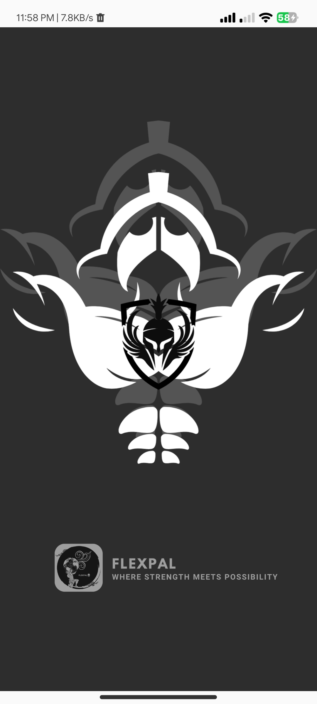
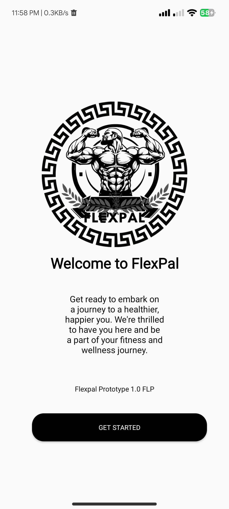
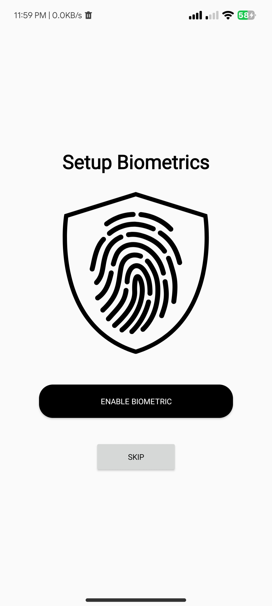
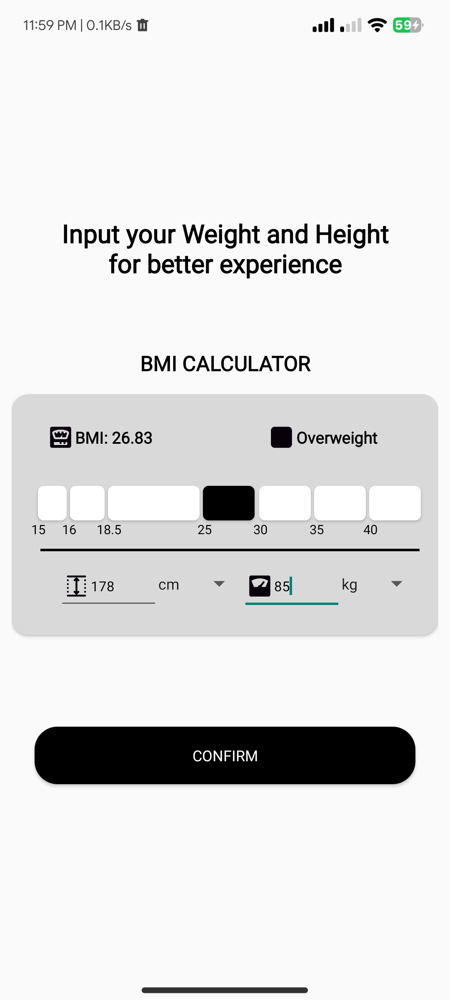
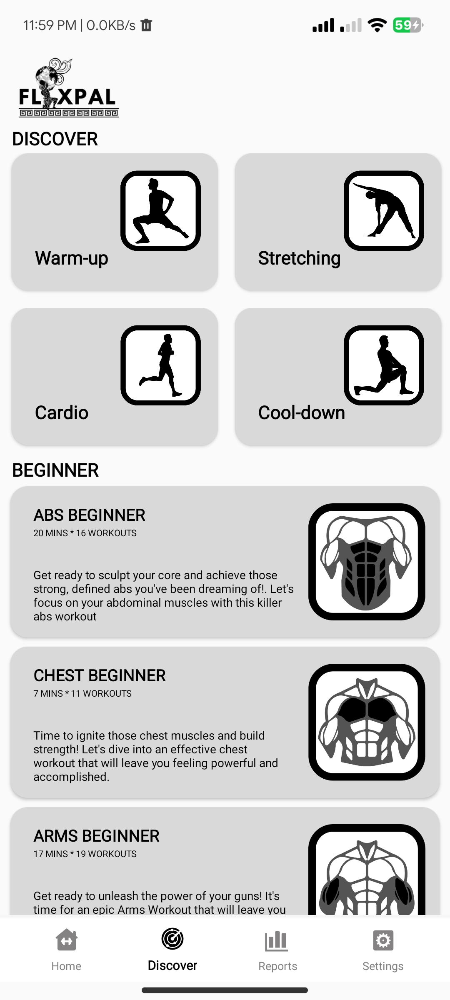
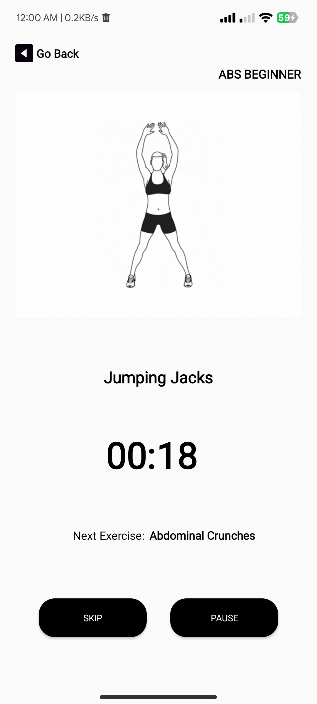

# 👊 Flexpal - Your Ultimate Fitness Companion
FlexPal is a native Android application designed to help users track their workouts, monitor progress, and achieve their fitness goals. Built with Java and the Android SDK, FlexPal offers a smooth, feature-rich experience for fitness enthusiasts of all levels.

## ⭐ Key Features
- 🏋️‍♀️**Workout Tracking:** Log exercises, sets, reps, and weights.
- 📈**Progress Visual:** View charts and graphs of your strength and consistency over time.
- 🗃️**Exercise Records:** Access a pre-loaded library of common exercises with visual instructions.
- ⚙️**User Profiles:** Save personal records and customize your fitness journey.

## 🛠️ Tech Stack & Libraries
This project is built using the following technologies and libraries:

#### Core Technologies
| Component | Description |
| :--- | :--- |
| **Language** | Java |
| **IDE** | Android Studio |
| **Platform** | Android SDK |

#### Libraries & Dependencies

| Library | Purpose |
| :--- | :--- |
| **Android TextToSpeech (TTS)** | Provides audio feedback and workout instructions for hands-free guidance. |
| **Android SharedPreferences** | Lightweight data storage used for saving user settings, preferences, and basic state. |
| **AndroidX Biometric Library** | Provides secure and standardized biometric (fingerprint/face) authentication for access control. |
| **Material Components** | Standardized UI components for a modern Android look and feel. |

## Screenshots

  
  
  
   
  
  *Loading Screen* &emsp; *Welcome & Setup* &emsp; *Biometric Login*
    

  
  
  
   
  
  *BMI Calculator* &emsp; *Main Dashboard* &emsp; *Exercise Details*
    

  
   
  
  *Sample Exercise*

